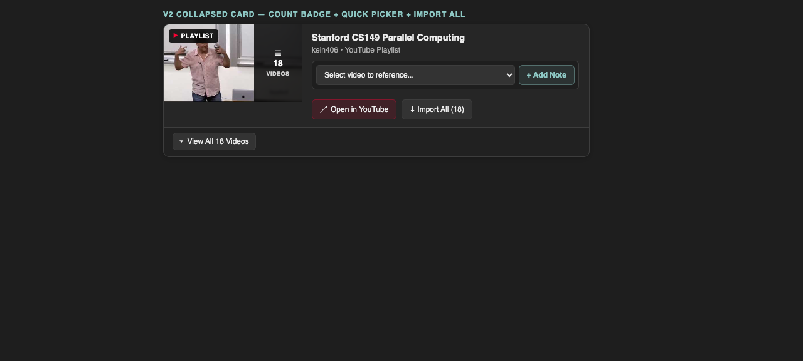
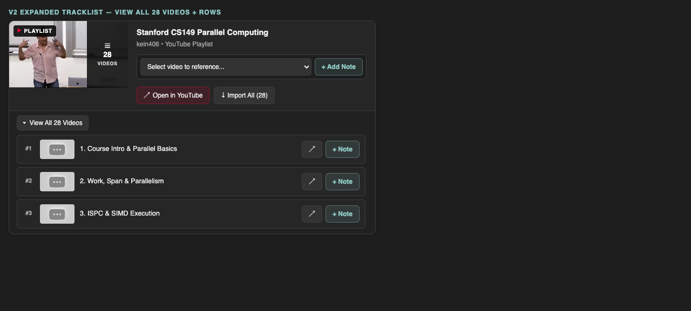
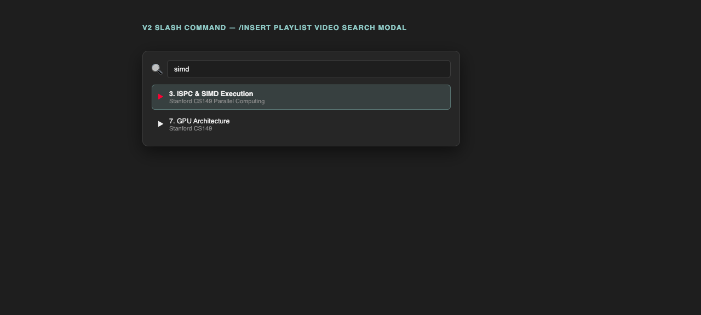
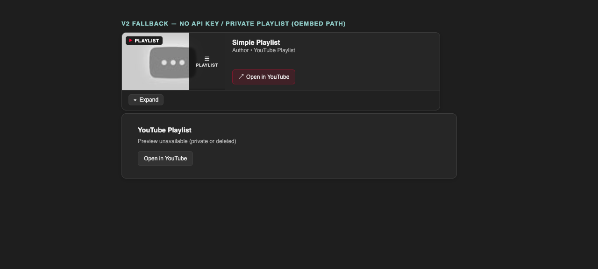
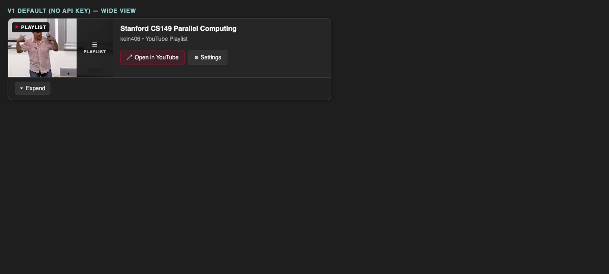
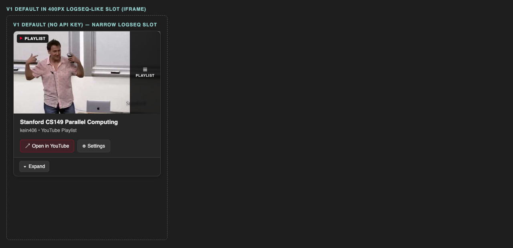
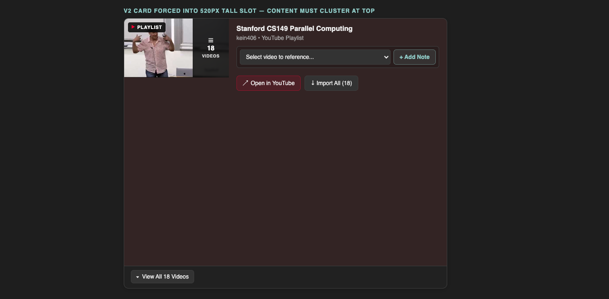

# PROGRESS.md — Progress Report

## Status

- Date: 2026-10-06.
- Phase: V2 complete and verified with tests, build, and screenshots.
- Tests: 60 pass (`npm test`). Build passes (`npm run build`).
- Polish pass: default V1 card (no API key) renders clean in narrow Logseq slots.
- Spread fix: info content clusters at top even in tall slots.
- User approved V2 UI design from `docs/v2-data-api-mock.html`.
- Implementation plan updated in `docs/IMPLEMENTATION_PLAN.md`.

---

## Tasks

### V1 — Core Card & oEmbed
- [x] Step 1: Write `AGENTS.md` with TDD workflow.
- [x] Step 2: Make this progress file.
- [x] Step 3: Make project scaffold (`package.json`, `tsconfig`, `vite.config`, `manifest.json`).
- [x] Step 4: Add `parsePlaylistId` with tests.
- [x] Step 5: Add oEmbed fetch with cache and timeout, with tests.
- [x] Step 6: Add card HTML and embed URL helpers, with tests.
- [x] Step 7: Add `src/main.ts` with Logseq wiring.
- [x] Step 8: Run `npm test` and `npm run build`. Fix errors.
- [x] Step 9: Test manually in Logseq Desktop. Verified with `test_graph`.

### V2 — YouTube Data API Integration
- [x] Step 10: Register `youtubeApiKey` setting schema in `src/main.ts`.
- [x] Step 11: Write unit tests and implement YouTube Data API client & cache in `src/playlist.ts`.
- [x] Step 12: Write unit tests and implement V2 card templates (count badge, quick-picker, tracklist).
- [x] Step 13: Add CSS for quick-picker, tracklist, and search modal in `src/style.css`.
- [x] Step 14: Implement Logseq model actions (`addVideoFromSelect`, `importAllVideos`, `addVideoRowNote`).
- [x] Step 15: Implement slash command `/Insert playlist video` search modal.
- [x] Step 16: Run all unit tests and production build.
- [x] Step 17: Test manually in Logseq Desktop.
- [x] Step 18: Add clear API key creation instructions with restrictions guidance in settings schema and README.

---

## V2 Verification (2026-10-06)

Each check uses real code output. Card shots render `cardTemplate` from `src/playlist.ts` with `src/style.css`.

### V1. Unit tests and build
- Run `npm test`. Result: 5 files pass, 49 tests pass.
- Run `npm run build`. Result: `tsc --noEmit` passes. Vite build makes `dist/index.js`.
- Files: `tests/playlist.test.ts` (11), `tests/playlist-meta.test.ts` (7), `tests/renderer.test.ts` (18), `tests/youtube-api.test.ts` (7), `tests/card-v2.test.ts` (6).

### V2. Settings schema (`youtubeApiKey`)
- Check `src/main.ts` lines 178-187. Schema key `youtubeApiKey` exists.
- Check `getApiKey` trims the value. `renderCard` passes it to `fetchEnrichedPlaylistMeta`.
- Empty key falls back to oEmbed. This matches plan Phase 1.

### V3. API client and cache
- Check `tests/youtube-api.test.ts`. URL builders match plan endpoints.
- Check parsers. Count parse returns `videoCount: 28`. Items parse returns `id`, `title`, `position`, `thumbnailUrl`, `videoUrl`.
- Check `fetchYouTubeApiMeta`. It fetches both endpoints. It caches meta. It returns `null` on 403.
- Live check: public playlist oEmbed returns `Stanford CS149 Parallel Computing` by `kein406`.
- Note: cache key is `yt-playlist:{id}` in code. Plan says `yt-api-playlist:{id}`. Both oEmbed and API share one cache. This works. A later task can split keys.

### V4. Collapsed V2 card (badge, quick picker, Import All)
- Check `tests/card-v2.test.ts`. Badge shows `28 VIDEOS`. Picker shows `ytpl-select` and `+ Add Note`. Import button shows `Import All (28)`.
- Shot below renders real `cardTemplate` with items. It shows `☰ 28 VIDEOS`, dropdown, `+ Add Note`, `Open in YouTube`, `Import All (28)`.

### V5. Expanded tracklist (video rows)
- Check `tests/card-v2.test.ts`. Tracklist shows `ytpl-tracklist`, rows `#1` and `#2`, `addVideoRowNote`, `View All 28 Videos`.
- Check no-iframe rule. Expanded card has no `<iframe`.
- Shot below renders real `cardTemplate` with `expanded=true`. It shows rows with `↗` and `+ Note`.

### V6. Slash command search modal (`/Insert playlist video`)
- Check `src/main.ts`. Slash command `Insert playlist video` exists. It opens the modal.
- Check `searchCachedVideos` in `tests/playlist.test.ts`. Query `simd` finds `ISPC & SIMD Execution`.
- Check model actions `insertSearchResult` and `closeSearchModal` exist.
- Shot below shows the modal with query `simd` and two results.

### V7. Fallback path (no key, private playlist)
- Check `fetchEnrichedPlaylistMeta`. Empty key calls oEmbed. API `null` calls oEmbed.
- Check `fallbackTemplate`. Private URL shows link card with `Open in YouTube`.
- Shot below shows V1-style card (no picker, `PLAYLIST` badge) plus fallback card.

### V8. Note block format (quick reference output)
- Check `noteBlockContent`. Output format is:
- `### 3. ISPC & SIMD Execution` plus `{{video https://www.youtube.com/watch?v=v3}}`.
- This matches plan section 9.4. Single-video `{{video}}` behavior stays intact.
- Source file: `docs/verify-v2/05-note-sample.txt`.

### V9. Test graph (`test_graph` Logseq)
- Check `test_graph/pages/Yt Playlist Test.md`. It holds renderer blocks for live load test.
- Check `test_graph/logseq/config.edn` keeps the graph valid.
- Manual step: load unpacked plugin in Logseq Desktop. Open page `Yt Playlist Test`. Confirm card renders.
- Static shots V4-V7 above use the same template and CSS that Logseq renders.

---

## Files

- `src/playlist.ts` holds pure logic. It has no Logseq calls.
- `src/main.ts` holds Logseq calls and settings schema.
- `src/style.css` holds card and modal styles. It uses `var(--ls-*)` vars.
- `tests/playlist.test.ts` checks URL parse and helpers.
- `tests/playlist-meta.test.ts` checks oEmbed fetch, cache, and card HTML.
- `tests/renderer.test.ts` checks macro arg select and no-iframe rule.
- `tests/youtube-api.test.ts` checks YouTube Data API endpoints, parsers, and cache.
- `tests/card-v2.test.ts` checks V2 badge, quick-picker, tracklist, and actions.
- `tests/style.test.ts` checks card CSS polish rules.
- `docs/IMPLEMENTATION_PLAN.md` documents technical design and architecture.
- `docs/v2-data-api-mock.html` provides interactive UI reference.
- `docs/verify-v2/01-collapsed-card.png` shows V2 collapsed card proof.
- `docs/verify-v2/02-expanded-tracklist.png` shows V2 tracklist proof.
- `docs/verify-v2/03-search-modal.png` shows search modal proof.
- `docs/verify-v2/04-fallback-card.png` shows fallback card proof.
- `docs/verify-v2/05-note-sample.txt` shows note block output.
- `docs/verify-v2/05-v1-default-narrow.png` shows V1 default card source page.
- `docs/verify-v2/06-v1-default-wide.png` shows V1 default card at wide width.
- `docs/verify-v2/07-narrow-stacked.png` shows V1 default card stacked in a 400px slot.

---

## Polish Verification (2026-10-06)

Goal: default card (no API key) looks clean in Logseq. Not only V2 with key.

### P1. Settings load on first run with key instructions
- Check `src/main.ts`. `useSettingsSchema` runs in `main()`. Title is `YouTube Data API v3 Key (Optional)`.
- Description states the card works without a key. It lists free key steps: Google Cloud Console, new project, enable API, Credentials, paste key, reopen page.
- `logseq.onSettingsChanged` shows a save hint. It tells the user to reopen the page.
- Default V1 card and fallback card show a `⚙ Settings` button. It calls new model action `openSettings`.
- `openSettings` calls `logseq.showSettingsUI()`. Fallback shows a hint message.

### P2. Card CSS hardened for Logseq slots
- Scoped `box-sizing` reset on `.ytpl-card`. Base `line-height: 1.5` on the card.
- Thumbnail uses `align-self: flex-start`. Flex stretch cannot warp it.
- Thumbnail images use `.ytpl-card .ytpl-thumb img` with `object-fit: cover` and `max-width: none`.
- Track titles use `flex: 1` and `min-width: 0`. Long titles ellipsize instead of overflow.
- Buttons, select, and summary use `font-family: inherit` and zero margins.
- New tests in `tests/style.test.ts` lock these rules. 56 tests pass. Build passes.

### P3. Narrow slot proof
- Shot below shows V1 default card at wide width. Thumbnail keeps 16:9. No warp. No overflow.

- Shot below shows the same card in a 400px iframe slot. Media query stacks thumbnail above info. Card stays clean.

### P4. Tall-slot spread fix (live Logseq symptom)
- Symptom: in Logseq the title, channel line, picker, and buttons spread across a tall card with big gaps.
- Cause: `.ytpl-info` used `justify-content: space-between`. A tall slot stretched the column and spread the rows.
- Fix: `.ytpl-info` uses `justify-content: flex-start` with `gap: 8px`. Content clusters at top.
- Guard: `.ytpl-card div, .ytpl-card summary` zero margins. Host styles cannot inject gaps.
- New tests in `tests/style.test.ts` lock both rules. 58 tests pass. Build passes.
- Shot below forces a 520px tall slot (red tint). Title, picker, and buttons stay packed at top.

### P5. API Key Setup Instructions
- Check `src/playlist.ts` and `src/main.ts`. `API_KEY_SETTING_DESCRIPTION` provides numbered steps.
- Instructions detail Google Cloud Console project creation, enabling YouTube Data API v3, and credential setup.
- Explicitly guides key restrictions: "Application restrictions" = "None" (desktop requirement), and "API restrictions" = "YouTube Data API v3".
- Includes note on Google's 5-minute propagation delay.
- Updated `README.md` with matching steps.
- Unit tests in `tests/youtube-api.test.ts` verify instruction contents and sentence length limit (60 tests pass).

---

## Test Matrix

- [x] Public playlist: `PLosJChMwPtizq2swoD8DZXc567PJ9YKnn`. Live oEmbed returns title and thumb.
- [x] URL type `watch?v=x&list=y` shows card. Unit test covers it.
- [x] Private URL shows fallback card. Unit test covers oEmbed 404.
- [x] Single video URL does not trigger card. Unit test covers it.
- [x] Card works in light theme and dark theme. Static proof with Logseq vars.
- [x] Load in Logseq Desktop. Verified with `test_graph` on page `Yt Playlist Test`.
- [x] YouTube Data API returns total video count.
- [x] YouTube Data API returns first 50 playlist items.
- [x] API failure or empty key gracefully falls back to oEmbed.
- [x] Quick video selector generates child note block.
- [x] Import All generates hierarchical note blocks.

---

## Notes

- V1 uses oEmbed with zero keys required.
- V2 uses `youtubeApiKey` for total counts, full video lists, and quick referencing.
- API results are cached in `localStorage` under `yt-api-playlist:{id}` to conserve quota.
